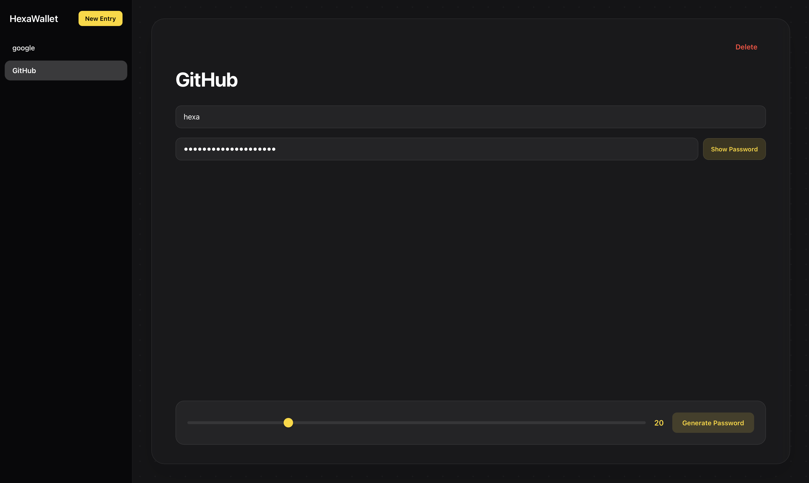

# HexaWallet

View HexaWallet at: https://hexa-programmer.github.io/HexaWallet/

HexaWallet is a minimal, web-based password manager built using HTML, CSS, and JavaScript.
It runs entirely in the browser with no backend and uses localStorage for persistence.

---

## Features

1) Multiple Entries Support: Create and manage multiple account credentials in a sidebar.

2) Password Generator: Built-in tool to instantly generate secure, custom-length passwords.

3) Persistent Storage: Uses localStorage to save your wallet data even after refresh.

4) Real-Time Editing: Instantly edit fields, with a quick show/hide password toggle.

---

## How it works:

Each entry is stored as an object:

```Js
{
    id: Date.now(),
    service: "Website / Service",
    username: "Username / Email",
    password: "GeneratedPassword123!"
}
```

---

## All entries are stored in browser storage using:
```
localStorage
```

---

This allows data to persist locally without any backend.

## Tech Stack:

- HTML5
- CSS3
- Vanilla JavaScript (no frameworks)

---

## Installation:

To run HexaWallet locally:

git clone https://github.com/Hexa-Programmer/HexaWallet.git
cd HexaWallet
open index.html

---

## ⚠️ Security Notice

HexaVault stores passwords locally in your browser using Local Storage.

This project is intended for learning and demonstration purposes and should **not** be used to store sensitive or real-world passwords.

Future versions may add client-side encryption using the Web Crypto API.

---

## Note:

This is a personal learning project and will continue to evolve over time.

Made with ❤️ by Hexa-Programmer